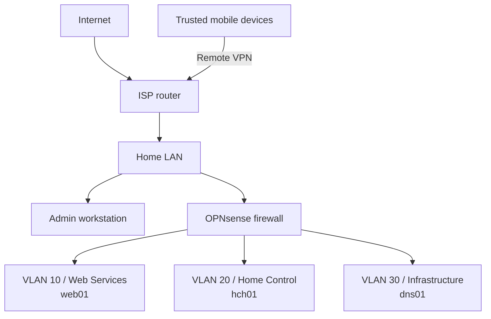
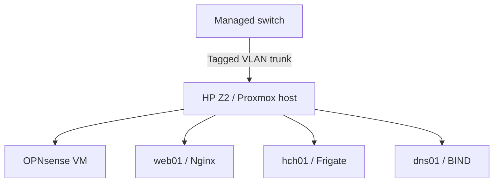

# Current lab network topology

The lab is easiest to understand in two views: the network boundaries and the virtual machines hosted by Proxmox. Addresses and connection details are intentionally omitted here.

## Network boundaries

Every path into a lab VLAN passes through OPNsense. OPNsense routes traffic, assigns VLAN client addresses, enforces firewall policy and terminates remote VPN access.

## Proxmox hosting

The managed switch and the VLAN-aware Proxmox bridge carry the tagged networks. The HP Z2 runs Proxmox; OPNsense and the service systems are virtual machines on that host.

## Important paths

| Source | Destination | Path |
| --- | --- | --- |
| Admin workstation | Lab administration and permitted services | Home LAN → OPNsense → target VLAN |
| Trusted mobile devices | Permitted internal services | ISP router → remote VPN terminated by OPNsense → target VLAN |
| `web01` and `hch01` | `dns01` | Source VLAN → OPNsense → VLAN 30 |
| VLAN clients | Internet | Source VLAN → OPNsense → home LAN → ISP router |

## Network roles

| Network | Current role |
| --- | --- |
| Home LAN | Admin workstation and upstream network for OPNsense |
| VLAN 10 | Web services: `web01` and Nginx |
| VLAN 20 | Home-control services: `hch01` and Frigate |
| VLAN 30 | Infrastructure services: `dns01` and BIND |

This topology document omits addresses, public-facing connection details, VPN configuration, management endpoints, device identifiers and camera connection details. Individual project records may retain private RFC1918 addresses when they explain a historical build or troubleshooting step.
