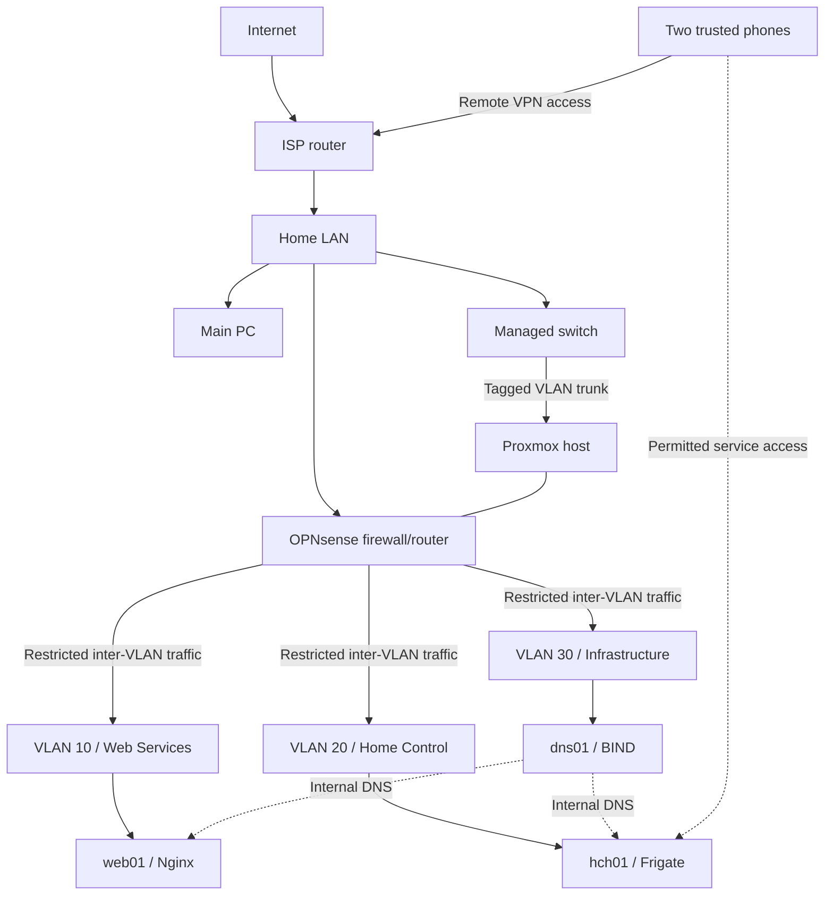

# Current lab network topology

This diagram shows the lab's logical structure without publishing addressing, VPN parameters, management endpoints or device-specific details.

## Network roles

| Network or path | Role |
| --- | --- |
| Home LAN | Main workstation and upstream path for the lab firewall |
| VLAN 10 | Web services, currently `web01` and Nginx |
| VLAN 20 | Home-control services, currently `hch01` and Frigate |
| VLAN 30 | Infrastructure services, currently `dns01` and BIND |
| Remote VPN access | Restricted access from two trusted phones to permitted internal services |
| OPNsense | Inter-VLAN routing, DHCP, firewall policy and VPN termination |
| Managed switch and Proxmox networking | Tagged Layer 2 path between the physical host and virtual networks |

## Security boundary

OPNsense restricts traffic between the home LAN, the three VLANs and remote VPN clients. Internal DNS provides service names across the permitted paths. The repository intentionally omits addresses, public-facing details, VPN configuration, management endpoints, device identifiers and camera connection details.

The diagram is logical rather than a physical cabling plan. `fw01` runs as an OPNsense VM on the Proxmox host.
