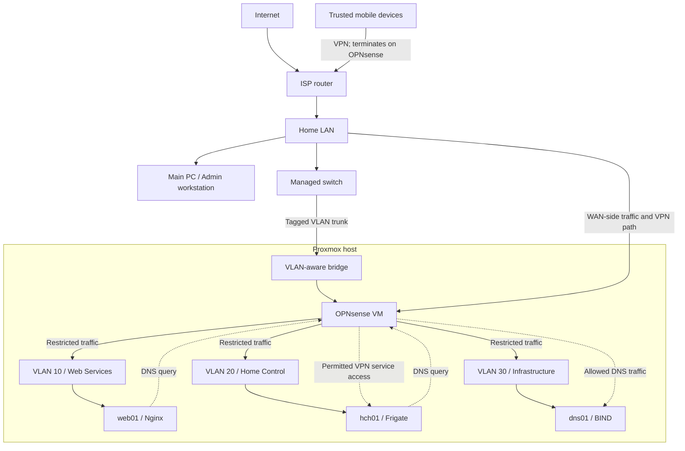

# Current lab network topology

This diagram shows the lab's logical structure without including addressing, VPN parameters, management endpoints or device-specific details.

## Network roles

| Network or path | Role |
| --- | --- |
| Home LAN | Contains the main admin workstation and provides the upstream path for the lab firewall |
| Main PC / Admin workstation | Primary control point for administering Proxmox, OPNsense and permitted lab services |
| VLAN 10 | Web services, currently `web01` and Nginx |
| VLAN 20 | Home-control services, currently `hch01` and Frigate |
| VLAN 30 | Infrastructure services, currently `dns01` and BIND |
| Remote VPN access | Restricted access from trusted mobile devices to permitted internal services through OPNsense |
| OPNsense | Inter-VLAN routing, DHCP, firewall policy and VPN termination |
| Managed switch and Proxmox networking | Tagged Layer 2 path between the physical host and virtual networks |

## Security boundary

OPNsense terminates remote VPN access and restricts traffic between the home LAN, the three VLANs and VPN clients. DNS queries from VLANs 10 and 20 traverse OPNsense before reaching `dns01` in VLAN 30. Internal DNS provides service names only across those permitted paths.

This topology document intentionally omits addresses, public-facing connection details, VPN configuration, management endpoints, device identifiers and camera connection details. Individual project records may retain private RFC1918 addresses where they explain a historical build or troubleshooting step.

The diagram is logical rather than a physical cabling plan. The OPNsense firewall is a VM hosted on Proxmox and connected through its VLAN-aware networking layer.
